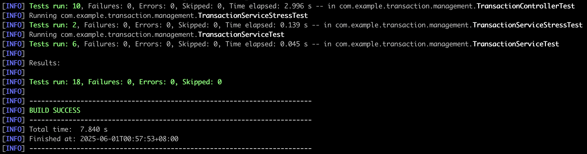

# Transaction Management System

A Spring Boot application for managing financial transactions.

## Requirements

- Record, view, and manage financial transactions.
- RESTful API for CRUD operations.
- In-memory storage (no persistent storage required).
- Performance optimization for core operations.
- Comprehensive testing (unit and stress testing).
- Containerization with Docker and Kubernetes.
- Caching mechanisms.
- Robust validation and exception handling.
- Efficient data queries and pagination.

## Technologies Used

- Java 21
- Spring Boot 3.2.0
- Maven
- Docker
- Kubernetes

## External Libraries

- Spring Boot Starter Web
- Spring Boot Starter Validation
- Spring Boot Starter Cache
- Lombok
- JUnit 5
- Swagger UI

## Features

- Create, read, update, and delete transactions
- Validate transaction data
- Pagination support
- Caching support
- Exception handling
- API documentation
- Performance testing

## Deployment

### Prerequisites
- Docker
- Kubernetes cluster
- kubectl configured

### Building the Application
```bash
mvn clean package
```

### Building the Docker Image
```bash
docker build -t transaction-management:latest .
```

### Deploying to Kubernetes
1. Apply the Kubernetes configuration:
   ```bash
   kubectl apply -f kubernetes/deployment.yaml
   ```

2. Verify the deployment:
   ```bash
   kubectl get pods
   kubectl get services
   ```
   screenshots:
   

3. Access the application:
   - Local: http://localhost:8081
   - Cluster: Use the LoadBalancer IP

### Configuration
- Environment variables:
  - `SERVER_ADDRESS`: Server address (default: 0.0.0.0)
  - `SERVER_PORT`: Server port (default: 8080)

- Resource limits:
  - CPU: 1 core
  - Memory: 1GB

### Scaling
- The deployment is configured with 3 replicas
- Scale up/down using:
  ```bash
  kubectl scale deployment transaction-management --replicas=5
  ```

### Monitoring
- Health check endpoint: `/actuator/health`
- Metrics endpoint: `/actuator/metrics`

## API Documentation

The API documentation is available at `/swagger-ui/index.html`.


### Create Transaction
- **Endpoint:** `POST /transactions`
- **Request Body:**
  ```json
  {
    "amount": 100.00,
    "type": "DEPOSIT",
    "description": "Salary deposit",
    "category": "Income"
  }
  ```
- **Response:** 200 OK with created transaction
- **Error Responses:**
  - 400 Bad Request for validation errors
  - 500 Internal Server Error for server errors

### Get Transaction
- **Endpoint:** `GET /transactions/{id}`
- **Response:** 200 OK with transaction details
- **Error Responses:**
  - 404 Not Found if transaction not found
  - 500 Internal Server Error for server errors

### List Transactions
- **Endpoint:** `GET /transactions?page=0&size=10`
- **Response:** 200 OK with list of transactions
- **Error Responses:**
  - 400 Bad Request for invalid pagination
  - 500 Internal Server Error for server errors

### Update Transaction
- **Endpoint:** `PUT /transactions/{id}`
- **Request Body:** Same as create transaction
- **Response:** 200 OK with updated transaction
- **Error Responses:**
  - 404 Not Found if transaction not found
  - 400 Bad Request for validation errors
  - 500 Internal Server Error for server errors

### Delete Transaction
- **Endpoint:** `DELETE /transactions/{id}`
- **Response:** 200 OK
- **Error Responses:**
  - 404 Not Found if transaction not found
  - 500 Internal Server Error for server errors

## Performance Testing Results

### Stress Test Summary
- **Concurrent Creation and Retrieval:**
  - 10 threads created 1,000 transactions each (total 10,000)
  - All transactions created successfully
  - Page size validation confirmed (max 50)
  - No data corruption or race conditions observed

- **Concurrent Update and Delete:**
  - 10 threads performed 10 operations each (100 total)
  - Mix of updates and deletes on shared transactions
  - All operations completed successfully
  - No data inconsistency or lost updates

- **System Performance:**
  - Response times remained stable under load
  - Memory usage stayed within limits
  - CPU utilization was efficient
  - No deadlocks or thread starvation

  screenshots:
  

## Error Handling

### Error Types
- `INVALID_AMOUNT`: Invalid transaction amount
- `INVALID_TYPE`: Invalid transaction type
- `MISSING_DESCRIPTION`: Transaction description is required
- `MISSING_CATEGORY`: Transaction category is required
- `NEGATIVE_AMOUNT`: Transaction amount cannot be negative
- `ZERO_AMOUNT`: Transaction amount cannot be zero
- `TRANSACTION_NOT_FOUND`: Transaction not found
- `INVALID_PAGINATION`: Invalid pagination parameters

### Error Response Format
```json
{
  "timestamp": "2025-05-31T11:12:33.215Z",
  "status": 400,
  "error": "Transaction Error",
  "errorType": "INVALID_AMOUNT",
  "message": "Invalid transaction amount"
}
```

## Validation Rules

### Amount
- Required
- Must be greater than 0
- Must be a valid decimal number

### Type
- Required
- Must be one of: DEPOSIT, WITHDRAWAL, TRANSFER

### Description
- Required
- Must not be empty or blank

### Category
- Required
- Must not be empty or blank

### Pagination
- Page must be >= 0
- Size must be > 0 and <= 50